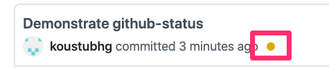

# ANZ Technical Tests

The solution to both the tests is included in this repo.

## I. Test 1

The solution to this is present in the folder `test-1`.
To run the `Dockerfile`, you can run this command
```
cd test-1 
docker build --no-cache -t anz-test-1  .  && docker run --rm -it  --name anz-test-1 -p 8000:8000  anz-test-1:latest
```

This will build and run the program in `main.go`. Once you see `starting http server` in the logs, the http server is ready to serve.

The following three endpoints are available:
```
1. http://localhost:8000/
2. http://localhost:8000/go
3. http://localhost:8000/opt
```
You can hit any one of the them to see the output

```
curl http://localhost:8000/
Hello, world.

curl http://localhost:8000/go
Don't communicate by sharing memory, share memory by communicating.

curl http://localhost:8000/opt
Don't communicate by sharing memory, share memory by communicating.
```

#### Changes

##### 1. Dockerfile

The Dockerfile includes the following changes
1. **Multi-stage docker build**
This allows us to build a go binary in an environment with the necessary tools for static compilation and then simply copy this binary in a `scratch` container which is the bare minimum. We can then simply distribute this `scratch` container which contains the binary.
2. **Use the `scratch` container in the final stage** 
Since the scratch container by itself is empty, the final image size and the attack surface area is greatly reduced.
e.g the final image size is just 8.2 MB which is mainly the binary.
3. **Removal of unnecessary packages (e.g. git)**
Tools like `git` are not needed for the functionality that we want. So, it has been removed
4. **Run as a non-privileged user**
This is important so that anyone with access to the container can't run anything undesirable in it.

##### 2. main.go
This is one small change `Addr:         ":8000",` so that the web server is accessible outside the docker network.

## II. Test 2

The application as well as the CI pipeline configuration code is placed in the `test-2` repo. The choice of tool for CI is [Concourse](https://concourse-ci.org/) and the tool used for deployment is [Flux](https://github.com/fluxcd/flux) which allows to use [GitOps](https://www.weave.works/technologies/gitops/).

**APP**

The app code is written in the `version.go` file. The version of the app is available through the `/version` endpoint. The app simply displays the contents of the `resource/version.json` file. It is the responsiblity of the CI pipeline to keep track of the appropriate versions and make modifications to the `version.json` file inside the docker container.

Once the docker container is ready. The CD tool will automatically deploy the docker image in Kubernetes cluster.

**Resources**

Public API implementation - http://130.211.117.181/version
Github repository (app) - https://github.com/koustubh25/anz-technical-tests/tree/master/test-2
Github repository (releases) - https://github.com/koustubh25/anz-technical-tests-releases
Concourse pipeline - http://104.198.178.83/teams/main/pipelines/anz-test-deploy

The flow is as shown below:


1. As soon as a developer makes an update to the `anz-technical-tests` repo, a  concourse pipeline is triggered. You can see the status changed on the commits page on github https://github.com/koustubh25/anz-technical-tests/commits/master like this 



2. This pipeline will do the following:
i. **Run unit tests** - The unit tests are located in `version_test.go` file. It will mainly check that `/resource/version.json` is present and the `json schema` is valid.
ii. **Run Integration tests** - This task will try and start the docker container for the app and then from another docker container try and hit the `/version` endpoint. If the response is the same as the file contents, then the tests pass. 
iii. **Create a Docker image** - This will create a docker images based on `Dockerfile` contents
iv. **Upload docker image** - The build docker image is then uploaded to Google Container Registry
The concourse pipeline can be accessed here (test/test)

3. There is a Flux k8s operator setup in the GKE cluster. This oeprator is responsible for listening on any updated to this repo on GCR. 
One other thread in this operator syncs the config from https://github.com/koustubh25/anz-technical-tests-releases into the cluster.

Once there is a new image  in GCR, it will update the releases repo and sync the config in the cluster. That will deploy the new docker image into the cluster.

4. Once it is deployed, a user can the simply hit curl http://130.211.117.181/version and check the version based on output.

**Risks Associated**

1. The setup is not designed for scaling. It would be a problem if there is large amount of traffic.
2. There is no SSL enabled for any of the hosted services.
3. Both the images and GKE cluster is all hosted in the US because of the availablity of free credits.

**Versioning**

[Semantic versioning](https://semver.org/) is used, that follows the convention 
```
MAJOR_VERSION.MINOR_VERSION.PATCH
```
e.g. `1.2.3`

In our code, for the sake of simplicity the concourse pipeline will always increment the patch version 
```
e.g. 1.2.3 -> 1.2.4
```

**Code run through**

I. Check current version
```
curl http://130.211.117.181/version
{
  "anz-version-test": [
    {
      "version": "0.0.1",
      "lastcommitsha": "0b2178f01296aa1815ff409d4a031cdf9d0a711e",
      "description": "pre-interview"
    }
  ]
}
```

II. Make some changes to this repo and push
III. Wait for the the build. You can confirm the build is complete once there is a green tick in front of your commit on github.
IV. Try again